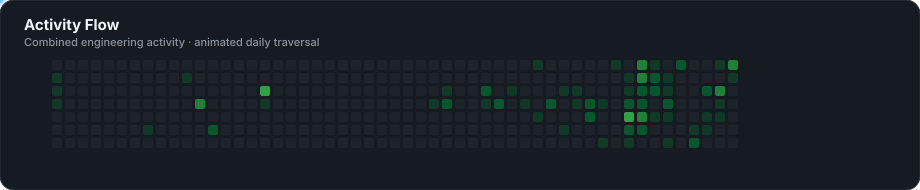

<div align="center">
  

  <br/>

  <a href="https://github.com/rohitkr8527"></a>
  <a href="https://gitlab.com/rohitkr8527"></a>
  <a href="https://www.linkedin.com/in/rohitkmr8527"></a>

  <br/><br/>

  
</div>

<br/>

## 👨‍💻 About Me

I’m an **IIT Guwahati student** specializing in **AI/ML Engineering, Applied AI, and Data Science**. I build intelligent systems that bridge the gap between model experimentation and production: end-to-end data pipelines, semantic retrieval (RAG), tool-augmented agents via Model Context Protocol (MCP), predictive modeling, and scalable Python AI backends.

<table>
<tr>
<td width="25%" align="center">
  <b>🤖 Applied AI & LLMs</b><br/>
  <sub>RAG · MCP · AI Agents · LangChain</sub>
</td>
<td width="25%" align="center">
  <b>🧠 Machine Learning</b><br/>
  <sub>Feature Eng · Ensembles · Evaluation</sub>
</td>
<td width="25%" align="center">
  <b>📊 Data Science</b><br/>
  <sub>EDA · Business Analytics · Statistical Insights</sub>
</td>
<td width="25%" align="center">
  <b>⚙️ AI Engineering</b><br/>
  <sub>FastAPI · FAISS · Vector Search · Pipelines</sub>
</td>
</tr>
</table>

---

## 🛠️ Technology Stack

<div align="center">
  
  <br/><br/>
  
  
  
  
  
  
  
  
  
</div>

---

## 🚀 Featured Engineering Projects

### 🤖 LLM Systems & Applied AI

<table>
<tr>
<td width="100%" valign="top">

#### [YouTube Video Q&A System](https://github.com/rohitkr8527/Youtube_Video_Q-A_System)
`RAG` · `LangChain` · `FAISS` · `Groq` · `Hugging Face`

Retrieval-augmented Q&A pipeline over video transcripts. Features intelligent chunking, semantic vector embeddings, FAISS indexing, and low-latency LLM synthesis via Groq.

[**Explore Repository →**](https://github.com/rohitkr8527/Youtube_Video_Q-A_System)

</td>
</tr>
</table>

### 🧠 Machine Learning & Deep Learning

<table>
<tr>
<td width="50%" valign="top">

#### [Vehicle Insurance Churn Prediction](https://github.com/rohitkr8527/vehicle-insurance-churn)
`Machine Learning` · `Classification` · `Feature Engineering`

End-to-end predictive modeling system to detect customer policy lapse and churn risk, with comprehensive EDA, imbalance handling, and hyperparameter tuning.

[**Explore Repository →**](https://github.com/rohitkr8527/vehicle-insurance-churn)

</td>
<td width="50%" valign="top">

#### [Sentiment Analysis Pipeline](https://github.com/rohitkr8527/sentiment-analysis)
`NLP` · `Text Classification` · `Scikit-Learn`

Natural language processing pipeline extracting sentiment indicators through text normalization, tokenization, TF-IDF representations, and classification models.

[**Explore Repository →**](https://github.com/rohitkr8527/sentiment-analysis)

</td>
</tr>
</table>

### 📊 Data Science & Analytics

<table>
<tr>
<td width="50%" valign="top">

#### [Vendor Performance Data Analysis](https://github.com/rohitkr8527/vendor-performance-data-analysis)
`BI` · `Operations Analytics` · `KPI Tracking`

Operational analytics measuring supplier reliability, defect rates, delivery turnaround times, and contract SLA compliance.

[**Explore Repository →**](https://github.com/rohitkr8527/vendor-performance-data-analysis)

</td>
<td width="50%" valign="top">

#### [Real Estate Price Prediction](https://github.com/rohitkr8527/Real-Estate-Price-Prediction)
`Regression` · `Feature Engineering` · `Predictive Modeling`

Predictive valuation model analyzing housing attributes, spatial variables, and price elasticity with multi-variable regression.

[**Explore Repository →**](https://github.com/rohitkr8527/Real-Estate-Price-Prediction)

</td>
</tr>
</table>

<details>
<summary><b>📂 Additional Repositories & Solutions</b></summary>
<br/>

- [Uber Ride Data Analysis](https://github.com/rohitkr8527/uber-ride-data-analysis) — Geospatial & temporal demand analytics
- [Customer Shopping Behavior Analysis](https://github.com/rohitkr8527/customer-shopping-behavior-analysis) — Customer segmentation & behavioral analysis
- [ML Models From Scratch](https://github.com/rohitkr8527/ml-models-from-scratch) — Fundamental machine learning algorithms built strictly in NumPy
- [ElevenLabs MCP Server](https://github.com/rohitkr8527/elevenlabs-mcp) — Model Context Protocol server for voice AI agents
- [TalentScout Assistant Chatbot](https://github.com/rohitkr8527/talentscout-assistant-chatbot) — Automated candidate screening chatbot
- [MediGuide Llama](https://github.com/rohitkr8527/MediGuide-Llama) — Domain-adapted clinical assistant LLM
- [Bank Marketing Classification](https://github.com/rohitkr8527/bank_marketing_classification) — Targeted campaign response modeling (Kaggle Playground Series)
- [Movie Recommendation System](https://github.com/rohitkr8527/Movie-Recommendation-System) — Content-based and collaborative filtering recommendation engine
- [Cyber Threat Classification](https://github.com/rohitkr8527/Cyber-Threat-Classification) — Applied ML for intrusion and security telemetry classification
- [Handwritten Digit Classification](https://github.com/rohitkr8527/Handwritten-Digit-Classification) — MNIST computer vision classification with deep neural networks
- [HOMO-LUMO Energy Gap Prediction](https://github.com/rohitkr8527/HOMO---LUMO-Gap-Prediction) — Molecular property prediction with machine learning

</details>

---

## 📈 Engineering Activity & Momentum

<!-- Real live activity dynamically rendered from public GitHub contribution telemetry & optional GitLab integration -->
<div align="center">
  
  <br/><br/>
  
  <br/>
  <sub>Automated daily telemetry: combines live GitHub activity with optional privacy-safe GitLab events via GitHub Actions.</sub>
</div>

---

## 🎯 Current Focus

```text
LLM Systems        →  Retrieval Augmented Generation (RAG), Tool Use, Model Context Protocol (MCP)
Machine Learning   →  Robust feature engineering, model interpretability, and production deployment
Data Science       →  Analytical storytelling, SQL mastery, and actionable business insights
AI Engineering     →  FastAPI backends, vector search optimization, and reproducible pipelines
Problem Solving    →  Data Structures, Algorithms, and clean software architecture
```

---

## 💡 How I Think About AI Products

```text
Useful AI = Problem Clarity
          + Quality Data
          + Rigorous Modeling
          + Continuous Evaluation
          + Clean Production Engineering
          + Tangible End-User Value
```

---

<div align="center">
  <b>Interested in AI/ML Engineering, Applied AI, and Data Science opportunities.</b>
  <br/><br/>
  <a href="https://www.linkedin.com/in/rohitkmr8527">LinkedIn</a>
  &nbsp;·&nbsp;
  <a href="https://github.com/rohitkr8527">GitHub</a>
  &nbsp;·&nbsp;
  <a href="https://gitlab.com/rohitkr8527">GitLab</a>
</div>
